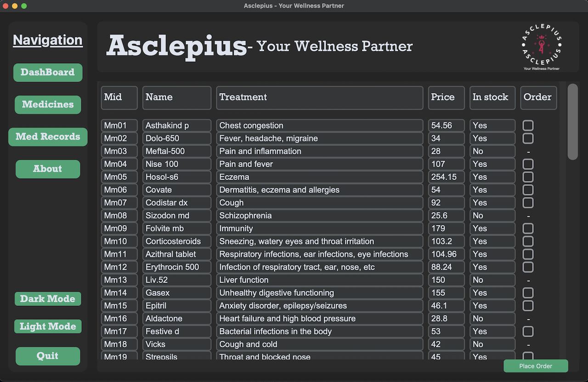

<h1 align="center">Asclepius</h1>



[](https://github.com/psf/black) [](https://github.com/ChiragAgg5k/asclepius/blob/master/LICENSE.md) [](https://github.com/ChiragAgg5k/asclepius)

Asclepius is a medical record management system for the students of Bennett University. It is a desktop application built using Python and Custom Tkinter. It allows the students to view available medicines at the University's Wellness center, look the medicine's details, check the availability of the medicine, and request for it. It also allows the students to order medicines from the Wellness center to their hostel rooms.

## Installation

Make sure you have Python 3.8 or above installed on your system. If not, you can download it from [here](https://www.python.org/downloads/).

1) Clone the repository:

```bash
cd {path}
git clone https://github.com/ChiragAgg5k/asclepius.git
cd asclepius
```

2) Install the required dependencies:

```bash
python3 -m pip install -r requirements.txt
```

3) Run the main script:

```bash
python -u src/main.py
```

## Usage

work in progress.

## Tools Used

1) Text Editor: [Visual Studio Code](https://code.visualstudio.com/)
2) Version Control: [Git](https://git-scm.com/)
3) Markdown Editor: [Obsdian](https://obsidian.md/)
4) DB Browser: [DB Browser for SQLite](https://sqlitebrowser.org/)
5) Custom Tkinter Widgets: [Custom Tkinter](https://github.com/TomSchimansky/CustomTkinter)
6) Fira Code Font: [Fira Code](https://github.com/tonsky/FiraCode)

## Contributors

This project was a team effort by a group of 6 students from Bennett University. The team members are:

###### Chirag Aggarwal - [Github](https://github.com/ChiragAgg5k) | [LinkedIn](https://www.linkedin.com/in/chirag-aggarwal-066b97248/) | [Twitter](https://twitter.com/ChiragAgg5k)
###### Shivangi Tripathi - [Github](https://github.com/ShiviTripathi13) | [LinkedIn](https://www.linkedin.com/in/shivangi-tripathi-bu/)
###### Divesh Saini - [Github](https://github.com/divesh0001) | [LinkedIn](https://www.linkedin.com/in/divesh-saini-a38610216/) | [Twitter](https://twitter.com/Diveshs05718024)
###### Akshay Negi - [Github](https://github.com/akshubawa) 
###### Aditi Chaturvedi -
###### Aman Boora - [Github](https://github.com/boora-aman) | [Linked](https://www.linkedin.com/in/boora-aman/)